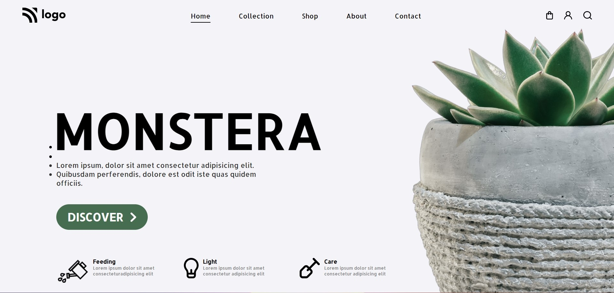

# Project 6 - HTML  and CSS 

By Shubham

Here's the Live Deployed Website 

## [DEPLOYED WEBSITE LINK](https://monsteracare.netlify.app/)

## What I learned from this Project?

- I learned about **layout** making through **Flexbox**.
- I also learned how to use **Icons**.
- I also learned how to design **Cards**.
- I also learned how to use **Icons in the Button**.

## This project took around **6.5 hours** to complete.
